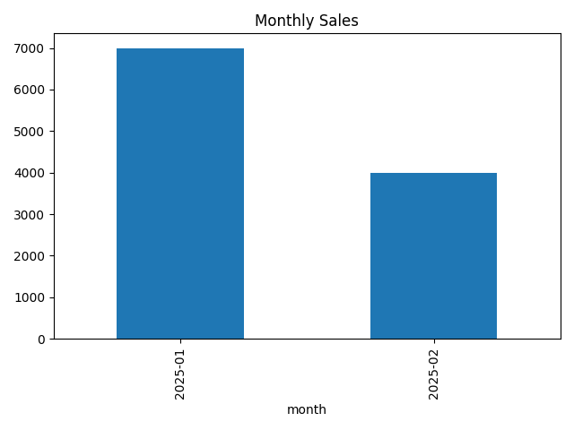

<p align="center">
  
</p>

# Excel売上自動集計ツール

## 概要
売上データ（Excel / CSV）を読み込み、
月別売上を自動で集計・グラフ化するPythonツールです。

## 使用技術
- Python
- pandas
- matplotlib
- openpyxl

## 機能
- CSV / Excel読み込み
- 売上計算
- 月別集計
- Excel出力
- グラフ自動生成

## 想定利用シーン
毎月の売上Excelを手作業で集計している業務の自動化を想定

## 実行方法
1. 必要ライブラリをインストール
```bash
pip install -r requirements.txt
